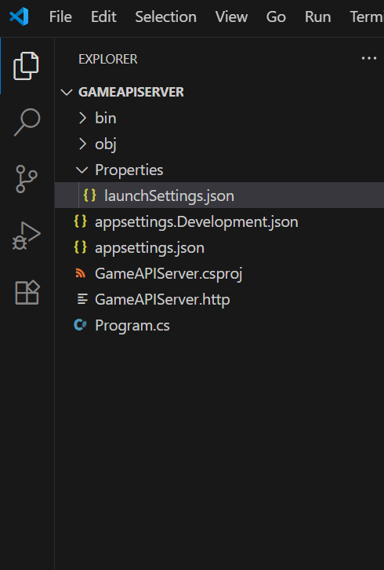

# VS Code에서 ASP.NET Core 게임 API 서버 개발 환경 구성하기 

VS Code에서 ASP.NET Core 기반 게임 API 서버를 개발하기 위한 환경 구성 방법을 안내합니다.


## 목차

1. [개요](#개요)
2. [필요 사항](#필요-사항)
3. [기본 설정](#기본-설정)
   - [.NET SDK 설치](#net-sdk-설치)
   - [VS Code 설치](#vs-code-설치)
   - [필수 확장 프로그램 설치](#필수-확장-프로그램-설치)
4. [프로젝트 설정](#프로젝트-설정)
    - [참고 자료](#참고자료)
    - [프로젝트 설정](#프로젝트-생성)
5. [바이브 코딩을 위한 설정 (Copliot-instruction.md 설정)](#바이브-코딩을-위한-설정-copliot-instructionmd-설정)
6. [확장 프로그램 사용법](#확장-프로그램-사용법)
7. [문제 해결 및 팁](#문제-해결-및-팁)
8. [결론](#결론)

## 개요

Visual Studio, Jetbrain사의 IDE, C# Dev Kit은 Visual Studio Code에서 C# 개발 경험을 향상시키는 유료 확장 프로그램입니다.   
하지만 **라이센스 비용** 때문에 모든 회사나 개발 팀이 이를 도입하기는 어려울 수 있습니다.   
이 문서에서는 C# Dev Kit 없이도 VS Code에서 효과적으로 ASP.NET Core 게임 API 서버를 개발할 수 있는 환경을 구성하는 방법을 안내합니다.  
  
## 필요 사항

- Windows, macOS 또는 Linux 운영 체제
- .NET 9 SDK (또는 필요한 버전)
- Visual Studio Code
- 인터넷 연결 (확장 프로그램 및 패키지 설치용)

## 기본 설정

### .NET SDK 설치

1. [.NET 다운로드 페이지](https://dotnet.microsoft.com/download)에서 .NET SDK를 다운로드하고 설치합니다.
2. 설치 후, 다음 명령어로 설치가 제대로 되었는지 확인합니다:

```powershell 
dotnet --version
```

### VS Code 설치

1. [Visual Studio Code 웹사이트](https://code.visualstudio.com/)에서 VS Code를 다운로드하고 설치합니다.

### 확장 프로그램 설치 (필수)

C# Dev Kit 대신 다음 무료 확장 프로그램을 설치하여 C# 개발 환경을 구성합니다:

1. **C# (Micrososft)** - 기본적인 C# 지원 
   - 설치: VS Code 확장 마켓플레이스에서 "C#"을 검색하여 Microsoft에서 제공하는 확장 프로그램 설치
   - 기능: 구문 강조, 기본 IntelliSense, 디버깅 지원

2. **Github Copilot + Gihub Copilot Chat** - 바이브 코딩을 위함
    - 설치: VS Code 확장 마켓플레이스에서 "Copilot" 검색
    - 기능: 코드 자동 완성, vscode 상단 툴 오른쪽에 돼지코 모양 누르면 chat기능 활성화

3. **REST Client** - API 테스트를 위한 도구 (Http 파일)
   - 설치: VS Code 확장 마켓플레이스에서 "REST Client" 검색
   - 기능: VS Code 내에서 직접 HTTP 요청을 작성하고 테스트
   - 사용법: [사용법](#rest-client)

4. **Mermaid Preview** - md파일의 다이어그램 시각화 도구
   - 설치: VS Code 확장 마켓플레이스에서 "Mermaid Preview" 검색
   - 기능: 'ReadMe'등의 마크 다운 파일 다이어그램 시각화시 유용함
   - 사용법: [사용법](#mermaid)


### 확장 프로그램 설치 (선택)

1. **Resharper (Jetbrains)** - C# 코드 분석기 (아직 데모 버전)
   - 설치: VS Code 확장 마켓플레이스에서 "Resharper"를 검색하여 설치. 이후 **C# 확장프로그램 제거**
   - 기능: C# 디버깅 및 코드 리팩토링을 편하게 하는 툴
   - **한계점** : 아직 테스트 중인 툴
        - 엉뚱한 디버깅
        - C# 확장과 호환이 안됨


## 프로젝트 설정

### 참고 자료
- 게임 API 서버에 대한 템플릿은 다음 링크에 있다. ("https://github.com/jacking75/edu_Learn_ASPNetCore_APIServer/tree/main/codes/GameAPIServer_Template")
- 빠르게 프로젝트를 시작하고 싶다면, 해당 링크의 템플릿을 이용해서 빠르게 시작할 수 있다. (해당 경우에는 아래 프로젝트 설정 목차를 생략한다.)  
- 처음부터 게임 API 프로젝트의 뼈대를 설정해보고 싶다면, 아래 프로젝트 설정 과정을 진행한다.


### 프로젝트 설정

- 터미널에서 다음 명령을 사용하여 새 ASP.NET Core 웹 API 프로젝트를 생성합니다:

```powershell
# 새 디렉토리 생성 및 이동
mkdir MyGameAPIServer
cd MyGameAPIServer

# 웹 API 프로젝트 생성
dotnet new webapi

# VS Code로 현재 디렉토리 열기
code .
```

- 그럼 다음과 같은 Explorer가 다음과 같이 구성된다.  
  
-  Program.cs를 다음과 같이 구성한다  
```csharp
// 1. 기본 설정
var builder = WebApplication.CreateBuilder(args);
var configuration = builder.Configuration;

// 2. DB 설정 (추후 추가)
//Db.Config 할것들 
//builder.Services.Configure<DbConfig>(configuration.GetSection(nameof(DbConfig)));

// 3. DB DI (추후 추가)
// builder.Services.AddTransient<IGameDb, GameDb>();
// builder.Services.AddSingleton<IMemoryDb, MemoryDb>();
// builder.Services.AddSingleton<IMasterDb, MasterDb>();
// etc..

// 4. 서비스 DI (추후 추가)
// builder.Services.AddTransient<IAuthService, AuthService>();
// etc..

// 5. 빌더 빌드
var app = builder.Build();

// 6. 마스터 데이터 로드 (추후 추가)
// var masterDataDB = app.Services.GetRequiredService<IMasterDb>();
// if (!await masterDataDB.Load())
// {
//     return;
// }

// 7. 미들웨어 등록 (추후 추가)
//app.UseMiddleware<GameAPIServer.Middleware.VersionCheckMiddleware>();
// etc..

// 8. 라우팅 및 실행 (추후 아래 2개 주석 해제)
//app.UseRouting();
//app.MapDefaultControllerRoute();
app.Run(configuration["ServerAddress"]);
```
- program.js는 프로그램 진입점이다.
- 1번 주석은 뭐뭐뭐다
- 2번 주석은 db설정 di 하는 부분이다 (좀더 자세히 설명)
- (설명)


(사진2)  
(이하 추가할 목록) 
- csproj설정 (nuget 패키지 추가 목록)
- launchSettings.json 설정
- appsettings.json설정 (db 주소 설정)
- controller, dto, service, middleware 등등.. 


## 바이브 코딩을 위한 설정 (Copliot-instruction.md 설정)

## 확장 프로그램 사용법

### Rest Client


### Mermaid


## 결론

C# Dev Kit 없이도 VS Code에서 ASP.NET Core 게임 API 서버를 효과적으로 개발할 수 있습니다.   
기본적인 확장 프로그램과 설정만으로도 대부분의 개발 작업을 수행할 수 있으며, 필요에 따라 추가적인 도구와 확장 프로그램을 설치하여 개발 환경을 향상시킬 수 있습니다.  

라이센스 비용 절감과 함께 가볍고 효율적인 개발 환경을 구축하는 데 이 가이드가 도움이 되기를 바랍니다.
