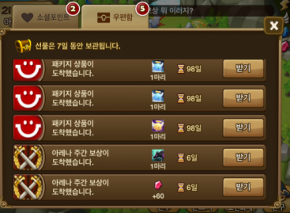
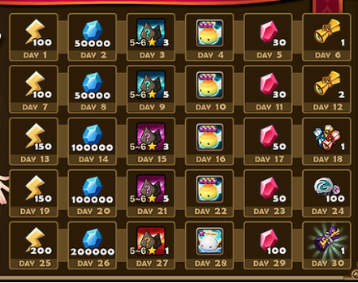

# 던전 파밍
게임 서버 개발 학습을 위한 프로젝트이다.  
API 서버 개발을 타겟으로 하고, 수집형 RPG 게임의 컨텐츠를 주로 모작하고 있다.  
게임의 근간은 스테이지 클리어 형식이고, 스테이지를 클리어 하면 보상을 받는다.    
    
      
# 필수 구현 조건
- Web API서버는 스케일아웃이 가능해야 한다. 
    - 로드밸런스를 사용하고 있다고 가정한다.
- 계정 생성은 `FakeHiveServer`를 사용하여 여기에서 인증하는 계정만 사용 가능하다.
    - 계정 생성 기능은 구현할 필요가 없다
- 인증과 관련해서 Redis를 꼭 사용해야 한다. `JWT` 사용 불가 
- 인증을 한 후(즉 로그인 후)의 모든 요청에 대해서 아래를 꼭 확인한다  
    - 인증 받은 유저인지 확인
    - 클라이언트 앱 버전 확인
    - 클라이언트 마스터 데이터(기획 데이터) 버전 확인
- DB는 샤딩을 하지 않는다. 
- 마스터 데이터는 서버 실행 후에는 변경되지 않는다. 
- DB는 MySQL, Redis만 사용한다.
    - Redis는 in-memory로만 사용한다
   
   

# 구현할 기능

## 유저의 새 게임 데이터 생성
- FakeHiveServer에 클라이언트의 인증 정보를 확인한다
- 처음으로 게임 서버에 접속하는 경우 게임 플레이를 위한 게임 데이터를 만들어야 한다.
    - 기본 게임 데이터(Level, Exp, Money 등), 자신의 아이템 데이터
     
    
## 로그인 
- FakeHiveServer에 클라이언트의 인증 정보를 확인한다

- **앱 버전, 마스터데이터 버전을 확인**한다.
    - 앱 버전과 마스터데이터 버전 정보는 임의로 DB에 데이터를 저장해서 사용하거나 혹은 코드에 상수로 정의한다.
    - 게임 서버가 실행 중에 앱 버전과 마스터데이터 버전은 변경되지 않는다
  

## 유저 게임 데이터
- 아래 정보를 클라이언트에 전송한다
    - 기본 게임 데이터, 아이템 데이터
  
    
## 우편함
- 우편 저장 개수는 **무한대**이다. 
- 클라이언트에서는 **1개 페이지마다 20개씩 표시**된다. 
    - ex:우편이 100개라면, 클라이언트에는 5페이지가 존재한다
- 클라이언트에서 우편함을 처음 열었다는 판단은 서버에서 **페이지 번호 1**로 판단한다.
    - 이후 클라이언트에서는 열어본 페이지에 대해서는 API 호출을 하지 않는다.
	- 새롭게 우편함을 열기 전까지는 클라이언트는 우편 데이터는 캐싱한다.
- 우편은 **유효 기간**이 있다
    - 유효 기간이 지나면 삭제된다. 삭제는 외부에서 정기적으로 한다고 가정한다. 즉 삭제 기능을 구현하지 않아도 된다.
	- 그러나 콘텐츠 구현을 다하고도 시간 여유가 있다면 정기적으로 삭제하는 기능을 만들어본다.
  
  
  
  
## 출석부
- **30일이 넘으면 다시 1일부터 시작한다**된다.
- **연속으로 출석을 하지 않으면 다시 1일부터 시작**한다.
- **보상은 우편함을 통해서** 준다.(지급 내용은 *마스터데이터의 `출석부보상` 시트 참고*)
  
  
  
   
## 인앱 결제 아이템 지급
- 클라이언트가 구글 혹은 애플 스토어에서 인앱을 샀다고 가정한다.
- 클라이언트는 서버에 지급 요청을 한다. 구매한 인앱 영수증을 보내야 한다. 
    - 영수증은 FakeHiveServer 에 등록된 영수증만 사용 가능하다
- 서버는 영수증 검증은 FakeHiveServer를 통해서 검증한다.
    - 단 **중복 요청**은 게임 서버에서 꼭 해야 한다.
- 문제 없으면 아이템을 `우편함`으로 지급한다.
    
  
## 강화  
- 강화 최대 횟수 제한은 있어야 한다.
- 무기, 방어구만 강화 가능하다.
    - `아이템 정보` 중 `최대 강화 단계`가 **0**인 아이템은 **강화 불가능** 아이템이다.
- 모든 아이템은 **강화 실패 시 파괴**한다.
- 모든 아이템의 모든 강화 단계 별 **성공 확률은 30%** 다.
- 강화 성공 시 무기는 공격, 방어구는 방어 수치가 올라가야 한다. (상승 수치는 현재 값의 **10%**)
- 유저의 아이템 별로 강화 단계 이력 정보가 있어야한다.
 

## 던전 스테이지
- 스테이지 단계 순서대로 클리어 해야 한다.
- (클라가 있다고 가정하고) 클라이언트에서 스테이지 탭을 누르면 완료한 스테이지 리스트를 서버에 요청하고, 서버는 응답한다.
- 클라이언트에서 스테이지를 선택한 후 서버에 요청하면 서버는
    - 선택 가능한지 검증한다.
    - 던전에 생성될 아이템을 리스트를 보낸다.
    - 적 NPC 리스트를 보낸다.
- 클라이언트는 아이템을 찾으면(파밍) 바로 서버에 알려준다.
    - 스테이지를 클리어 해야만 찾은 아이템을 보상으로 준다
- NPC 전투는 클라이언트에서 실행되고, 결과를 서버에 보낸다.
    - 처치한 NPC 수와 종류에 따라서 받는 경험치 등이 달라진다.  
    - 클라이언트는 NPC 한 마리 잡을 때 마다 서버로 송신.
- 스테이지가 완료되면, (서버가) 보상을 준다. 
    - 스테이지 클리어 조건은 스테이지에서 나오는 모든 몬스터를 다 잡아야한다.
- 마스터데이터의 `스테이지_아이템`, `스테이지_공격NPC`를 참고한다. 

  

## 채팅
- 웹서버만으로 채팅을 구현한다
- 채팅은 로비 단위로 구분된다. 로비 번호는 1~ 100개
- 유저는 로그인 시에 자동으로 로비에 입장된다.  
- 유저는 로비 번호를 선택해서 지정한 로비에 입장 가능하다.
- 채팅 창을 통해서 이전 채팅 히스토리를 볼 수 있어야 한다. 단 현재 채팅에서 50개까지만 가능하다.
- Redis를 사용하여 구현한다.  
  
   
    
	
여기까지 구현을 다했다면, 아래 작업을 추가해 보기 바란다
- 도전과제 콘텐츠 만들기
    - 타 게임을 참고해서 직접 기획과 마스터데이터까지 만들어서 구현한다.
- 유닛테스트 만들기
- 클라이언트를 만들어서 그럴듯한 온라인 게임 만들기
- 비실시간 혹은 실시간 PvP 콘텐츠 만들기

   

# Redis `Hashes` 이슈

`Hashes` 멤버의 유효 시간을 지정하기 위해서는 **Redis Enterprise 서버**를 사용해야한다. ([참고](http://redisgate.kr/redis/command/hset.php))

# Sequence Diagram

## CreateAccount
```mermaid
sequenceDiagram
    actor C as Client
    participant A as API Server
    participant M as MySQL

    C->>+A : CreateAccountRequest

        A->>+M : 게임 플레이 데이터 생성
        M-->>-A : 생성 완료

        A->>+M : 출석부 데이터 생성
        M-->>-A : 생성 완료

        A->>+M : 기본 지급 아이템 추가
        M-->>-A : 지급 완료

        A->>+M : 계정 데이터 생성
        M-->>-A : 생성 완료

    A-->>-C : CreateAccountResponse
```

## Login
```mermaid
sequenceDiagram

    actor C as Client

    participant A as API Server
    participant M as MySQL
    participant R as Redis

    C->>+A : LoginRequest


        A->>+M : 유저 계정 Load
        M-->>-A : 계정 정보

        A->>+M : 유저 플레이 데이터 Load
        M-->>-A : 플레이 데이터

        A->>+M : 유저 인벤토리 아이템 Load
        M-->>-A : 인벤토리 아이템

        A-->>A : AuthToken 생성
        
        A->>R : 유저 정보 캐싱
        note over A, R: "AuthUser:{"AccountId":"", "UserId":"", "AppVersion":"","AuthToken":""...}"`


    A-->>-C : LoginResponse
```

## AttendanceCheck

```mermaid
sequenceDiagram
    actor C as Client
    participant A as API Server
    participant M as MySQL


    C->>+A : AttendanceCheckRequest


        A->>+M : 유저 출석부 Load
        M-->>-A : 출석부

        A->>+M : 유저 출석일 갱신
        M-->>-A : 갱신 완료

        A->>+M : 유저 메일함에 출석 보상 아이템 추가
        M-->>-A : 추가 완료


    A-->>-C : AttendanceCheckResponse
```

## GetLastAttendanceDay

```mermaid
sequenceDiagram
    actor C as Client
    participant A as API Server
    participant M as MySQL

    C->>+A : GetLastAttendanceDayRequest


        A->>+M : 유저 출석부 Load
        M-->>-A : 출석부


    A-->>-C : GetLastAttendanceDayResponse
```

## GetMaillist

```mermaid
sequenceDiagram
    actor C as Client
    participant A as API Server
    participant M as MySQL

    C->>+A : GetMaillistRequest
    

        A->>+M : 메일 리스트 Load
        M-->>-A : 메일 리스트


    A-->>-C : GetMaillistResponse

```

## ReceiveMail

```mermaid
sequenceDiagram
    actor C as Client
    participant A as API Server
    participant M as MySQL

    C->>+A : ReceiveMailRequest


        A-->>+M : 수신 대상 메일 Load
        M-->>-A : 메일

        A-->>+M : 수신 대상 메일 상태 갱신 (미수신 -> 수신)
        M-->>-A : 갱신 완료

        A-->>+M : 유저 인벤토리로 메일 아이템 추가
        M-->>-A : 추가 완료

        
    A-->>-C : ReceiveMailResponse
```

## ReceiveInAppProduct

```mermaid
sequenceDiagram
    actor C as Client
    participant A as API Server
    participant M as MySQL

    C->>+A : ReceiveInAppProductRequest


        A->>+M : 영수증 저장
        M-->>-A : 저장 완료

        A->>+M : 유저 메일함으로 인앱 상품 아이템 추가
        M-->>-A : 추가 완료


    A-->>-C: ReceiveInAppProductResponse
```

## EnhanceItem

```mermaid
sequenceDiagram
    actor C as Client
    participant A as API Server
    participant M as MySQL
    
    C->>+A : EnhanceItemRequest

        A->>+M : 아이템 정보 Load
        M-->>-A: 아이템 정보

        A-->>A : 아이템 강화

        alt 성공
            A->>+M : 아이템 갱신
            M-->>-A : 갱신 완료
        else 실패
            A->>+M : 아이템 삭제
            M-->>-A : 삭제 완료
        end


    A-->>-C : EnhanceItemResponse
```

## EnterStage

```mermaid
sequenceDiagram
    actor C as Client
    participant A as API Server
    participant R as Redis

    C->>+A : EnterStageRequest


        A-->> A : 전투 정보 생성

        A->>+R : 전투 정보 저장
        note over A, R : "UserBattleInfo:{"StageCode","",...}"
        R-->>-A : 저장 완료


    A-->>-C : EnterStageResponse
```

## DefeatEnemy

```mermaid
sequenceDiagram
    actor C as Client
    participant A as API Server
    participant R as Redis

    C->>+A : DefeatEnemyRequest


        A->>+R : 전투 정보 요청
        note over A, R : "UserBattleInfo:{"StageCode":"",...}"
        R-->>-A : 전투 정보

        A->>+R : 적군 수 갱신
        note over A, R : "UserBattleInfo:{"StageCode","",...}"
        R-->>-A : 갱신 완료


    A-->>-C : DefeatEnemyResponse
```

## FarmingItem

```mermaid
sequenceDiagram
    actor C as Client
    participant A as API Server
    participant R as Redis

    C->>+A : FarmingItemRequest


        A->>+R : 전투 정보 요청
        note over A, R : "UserBattleInfo:{"StageCode","",...}"
        R-->>-A : 전투 정보

        A->>+R : 파밍 아이템 추가
        note over A, R : "UserBattleInfo:{"StageCode","",...}"
        R-->>-A : 갱신 완료


    A-->>-C : FarmingItemResponse
```

## CompleteStage

```mermaid
sequenceDiagram
    actor C as Client
    participant A as API Server
    participant R as Redis
    participant M as MySQL

    C->>+A : CompleteStageRequest


        A->>+R : 전투 정보 요청
        note over A, R : "UserBattleInfo:{"StageCode","",...}"
        R-->>-A : 전투 정보

        A->>+M : 스테이지 완료 이력 추가 OR 갱신
        M-->>-A : 추가 OR 갱신 완료

        A->>+M : 유저 경험치 갱신
        M-->>-A : 갱신 완료

        A->>+M : 파밍 아이템을 유저 인벤토리에 추가
        M-->>-A : 추가 완료

        A->>+R : 유저 전투 정보 삭제
        R-->>-A : 삭제 완료


    A-->>-C : CompleteStageResponse
```

## ChangeChannel

```mermaid
sequenceDiagram
    actor C as Client
    participant A as API Server
    participant R as Redis

    C->>+A : ChangeChannelRequest


        A->>+R : 유저 채널 갱신
        note over A, R : "AuthUser:{"AccountId":"",...}"
        R-->>-A : 갱신 완료


    A-->>-C : ChangeChannelResponse
```

## SendChatMessage

```mermaid
sequenceDiagram
    actor C as Client
    participant A as API Server
    participant R as Redis

    C->>+A : SendChatMessageRequest


        A->>+R : 유저 채팅 메시지 추가
        note over A, R : "ChatInfo:{"Email":"", "Message":""}"
        R-->>-A : 추가 완료


    A-->>-C : SendChatMessageResponse
```

### SendChatMessage API에서의 RedisStream 설명
1. 클라이언트에서 `SendChatMessage` API를 호출하면 해당 API의 컨트롤러에서는 `Redis`에서 읽어온 유저의 `CertifiedUser` 인스턴스의 멤버 변수인 `ChannelNumber`를 고유 키 값으로 하여 `Redis` 내부에 새로운 `RedisStream` 구조를 생성한다. (*만약 이미 동일한 키의 `RedisStream`이 존재한다면 추가 생성하지 않는다.*)

- 아래 그림은 각 채널 별로 `RedisStream`이 생성된 예시다.

 

2. 이후 클라이언트의 채팅 메시지를 직렬화하여 `RedisStream`에 추가하게되는데, 이때 `Field`에는 빈 문자열을 넣는다. 
(*`Field`는 하나의 `RedisStream`에서 서로 다른 `Feild`에 해당하는 스트림만 읽을 때 사용된다. 우리의 API 서버는 오직 해당 채널의 채팅 메시지만 존재하므로 `Field`를 사용하지 않는다.*)

 

- 그럼 다음과 같이 해당 채널의 `RedisStream`에 새로운 스트림이 추가된다.

 

## GetLatestChatMessage

```mermaid
sequenceDiagram
    actor C as Client
    participant A as API Server
    participant R as Redis

    C->>+A : GetLatestChatMessageRequest


        alt MessageId가 없다
            A->>+R : 최신 메시지 Load

        else MessageId가 있다
            A->>+R : MessageId보다 큰 메시지 Load

        end

        note over A, R : "ChatInfo:{"Email":"", "Message":""}"
        R-->>-A : 채팅 메시지


    A-->>-C : GetLatestChatMessageResponse
```

### GetLatestChatMessage API에서의 RedisStream 설명

최신 메시지를 읽는 과정은 클라이언트의 `MessageId` 값에 따라 두 가지로 구분된다.

#### 서버가 MessageId가 없는 요청 패킷을 수신 받은 경우
- 클라이언트가 `GetLatestChatMessage` API를 처음 호출하는 경우에는 서버로부터 수신 받았던 최신 `MessageId`가 존재하지 않음으로, 요청 패킷의 `MessageId`에 빈 문자열을 넣어 송신한다.

 

- 이때 서버는 해당 채널의 모든 채팅 메시지 중, 가장 최신 메시지 하나만 읽어서 응답하게 된다. (*이때 해당 메시지의 `Id`를 클라이언트에게 송신하는데 해당 `Id`는 클라이언트 측에서 최신 메시지를 주기적으로 수신 받을 때 사용된다.(아래 부분에서 자세히 설명)*)

##### 해당 채널의 메시지 스트림 리스트

 

##### 클라이언트가 응답 받은 데이터

 

#### 서버가 MessageId가 있는 요청 패킷을 수신 받은 경우

- 서버로부터 최신 채팅 메시지를 수신 받은 클라이언트는 이후 `GetLatestChatMessage` API 호출시에는 다음과 같이 `MessageId`에 값을 넣는다.

 

- 서버에서는 이제 해당 채널의 `RedisStream`의 스트림 중 요청 받은 `Id`의 값보다 **큰** 값 하나를 읽어서 반환한다.

##### 해당 채널의 메시지 스트림 리스트

 

##### 클라이언트가 응답 받은 데이터

 

## GetChatMessageHistory

```mermaid
sequenceDiagram

    actor C as Client
    participant A as API Server
    participant R as Redis

    C->>+A : GetChatMessageHistoryRequest


        A->>+R : MessageId보다 큰 메시지 리스트 Load
        note over A, R : "ChatInfo:{"Email":"", "Message":""}"
        R-->>-A : 메시지 리스트


    A-->>-C: GetChatMessageHistoryResponse
```

### GetChatMessageHistory API에서의 RedisStream 설명

아쉽게도 `RedisStream`에는 페이지 별 조회 기능이 없으므로, 다음과 같이 페이지 조회 기능을 `API Server`에서 구현하였다.

- 먼저 해당 채널의 모든 스트림을 읽어온 후, 요청 페이지 번호와 페이지 별 메시지 개수를 통해 해당 페이지에 속해있는 스트림 데이터만 클라이언트에게 응답해줬다.